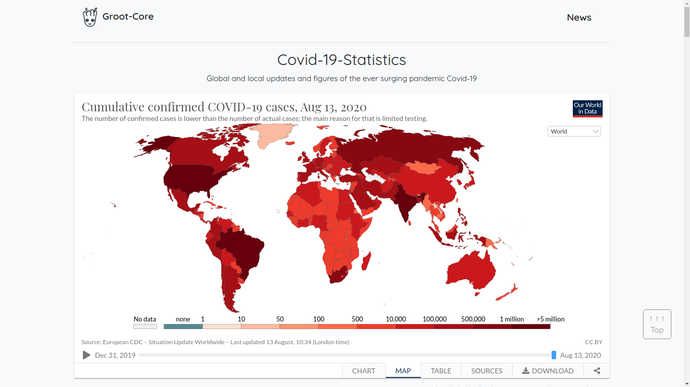
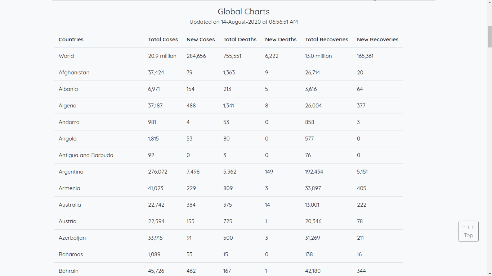

# Covid-19-Updates

Deployed on Heroku at grootcovid.herokuapp.com

## Description

This is a simple web application built on [Django 3](https://docs.djangoproject.com/en/3.1/) and [Bootstrap 4](https://getbootstrap.com/docs/4.0/getting-started/introduction/). It helps track the statistics of the Global Pandemic.  
It has two main features:  

- Coronavirus Statistics  
- Coronavirus News  

It looks quite similar to and was inspired by [Codid](https://codid19.netlify.com/) by [@Chris](https://github.com/ChrisAchinga) and [Covid Monitor](https://covidmonitor.gq/) by [@Collins](https://github.com/collinsmuriuki/).

## Screenshots

### Stats (Landing Page)

The landing page shows a frame with summary Geo-Statistics with options to naviagate across different types of visualizations and insight.  

### Charts (Landing Page)

Scrolling further down reveals constantly updated figures of cases in all the affected coutries of the world.  
The following can be seen from the table:  

- Total Cases
- New Cases
- Total Deaths
- New Deaths
- Total Recoveries
- New Recoveries

### News

This page displays data from around the globe around the topic __Corona Virus__. This page fetches all its news data from __Aljazeera News__ website.

  

#### Glitch

The downside is that sometimes the news do not directly relate to the Virus, a page is displayed to (politely :smile:) redirect the user to the source page.

### Responsitivity  

It is responsive to both Desktop and Mobile devices.  

## Installation and Setup

### Clone the repo

`git clone git@github.com:Groot-Core/Covid-19-Updates.git`

### Create a virtual environment

There are several ways depending on the OS and package you choose. Here's my favorite  
`sudo apt-get install python3-pip`  
`pip3 install virtualenv`  
`virtualenv venv` (you can call it venv or anything you like)

#### Activate the virtual environment  

`source venv/bin/activate`  

### Install the requirements

Within the activated virtual environment run:

`pip3 install -r requirements.txt`

#### Environment tweaks

Make the following changes within `settings.py`:  

- SECRET_KEY = edit the file `secrets.py`  
- DEBUG = set to false in production  
- ALLOWED_HOSTS = ['.localhost', '.herokuapp.com', '.127.0.0.1']

### Run the surver locally

`python manage.py migrate`  
`python manage.py runserver`  

## Usage  

Your computer must be connected to an active internet connection.  

## Contributiions  

I believe this project could use a lot of upgrades and improvements. Please feel free to open a __Pull Request__ or report an __Issue__.  

## Authors

Initial work by [@Tim](https://github.com/wwangwe)  
Special Credits to Alice and Gilbert

## License

The project is licensed under the MIT License

## Project status

Maintainance and Bug Fixes  
